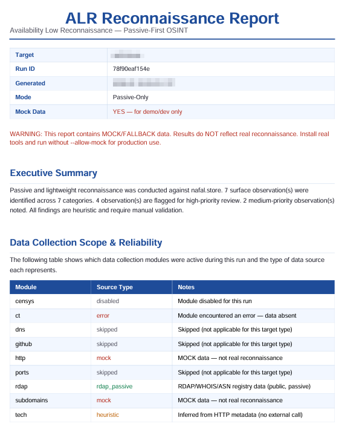
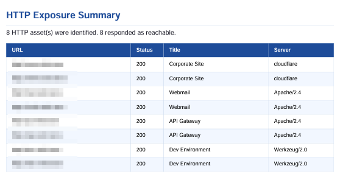

# ALR - Availability Low Reconnaissance

ALR은 외부에 드러난 정보가 많지 않은 대상, 즉 가용성이 낮은 공개 자산을 조용히 확인하기 위한 OSINT 도구입니다.  
기본 흐름은 패시브 수집을 우선하고, 필요한 경우에만 가벼운 HTTP 확인을 수행합니다. 공격적 스캔이나 취약점 악용을 목적으로 하지 않습니다.

## What It Does

- 도메인 또는 IP를 기준으로 공개 정보 기반 정찰을 수행합니다.
- `subfinder`, Certificate Transparency, RDAP/WHOIS/ASN 정보를 함께 정리합니다.
- `httpx`로 접근 가능한 HTTP 자산을 낮은 강도로 확인합니다.
- 수집 결과를 JSON, Markdown, PDF 리포트로 저장합니다.
- 모든 판단은 휴리스틱 기반이며, 확정된 취약점으로 표현하지 않습니다.

## Example Report

리포트는 대상 정보, 수집 범위, 신뢰도, HTTP 노출 요약을 한 번에 검토할 수 있도록 구성됩니다.





## Project Structure

```text
cli/          CLI 진입점
core/         실행 흐름과 타겟 컨텍스트
collectors/   서브도메인, CT, RDAP, HTTP 등 수집 모듈
analyzers/    공격 표면 휴리스틱 분석
reports/      JSON, Markdown, PDF 작성기
models/       데이터 스키마
utils/        로깅, 도구 확인, 서브프로세스 실행
tests/        pytest 기반 테스트
scripts/      외부 도구 설치 스크립트
```

## Requirements

- Python 3.10+
- Linux 또는 WSL 권장
- Go 1.19+ (`subfinder`, `httpx` 설치용)
- Python 패키지: `python-dotenv`, `reportlab`, `pytest`

기본 실행에 필요한 외부 도구는 `subfinder`와 `httpx`입니다. `dnsx`, `naabu`는 보조 활성 모드에서만 사용합니다.

## Install

```bash
git clone https://github.com/GrayOM/Availability-Low-Reconnaissance.git
cd Availability-Low-Reconnaissance

python3 -m pip install -r requirements.txt
bash ./scripts/bootstrap_tools.sh
python3 -m cli.main --doctor
```

## Usage

```bash
# 도메인 대상
python3 -m cli.main --domain example.com

# IP 대상
python3 -m cli.main --ip 203.0.113.10

# 도구 없이 흐름만 확인
python3 -m cli.main --domain example.com --allow-mock

# PDF 생성을 생략
python3 -m cli.main --domain example.com --no-pdf

# GitHub 공개 노출 힌트 포함
python3 -m cli.main --domain example.com --enable-github-check
```

## Output

기본 출력 위치는 `data/outputs/<run_id>/`입니다.

```text
output.json   정규화된 전체 결과
report.md     Markdown 요약
report.pdf    PDF 리포트
```

PDF가 생성되는 경우 대상명 기반 사본이 `output/` 아래에도 저장될 수 있습니다.

## Test

```bash
python3 -m pytest tests/ -v
```

## Legal Notice

ALR은 승인된 대상의 공개 노출 상태를 검토하기 위한 도구입니다. 반드시 명시적인 허가를 받은 대상에 대해서만 실행하십시오. 결과는 공개 데이터와 패턴 기반 단서이며, 수동 검증 전까지 취약점으로 단정하면 안 됩니다.
